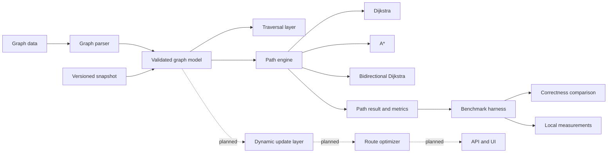

# ATLAS

ATLAS is an **in-development C++20 routing and optimization engine** for
weighted graph algorithms. It is being built as an algorithm-first portfolio
project: graph correctness, route reconstruction, reproducible evaluation, and
measured tradeoffs come before databases, hosted APIs, or a map UI.

> Current status: **Research Prototype — Phase 8 demonstration quality
> in progress.**

## Project identity

ATLAS is intended to answer a focused engineering question:

> How do different routing algorithms behave on the same weighted graph and
> query workload, and can their correctness and tradeoffs be demonstrated with
> reproducible evidence?

The project currently implements a deterministic in-memory foundation, dynamic
graph revisions, route caching, and four shortest-path engines. It does **not**
yet provide external traffic ingestion, map data ingestion, VRP optimization, a
network API, or a UI.

## What is implemented

- C++20 core library built with CMake
- Validated directed weighted adjacency-list graph
- Finite, non-negative edge-weight validation
- Deterministic text graph parser with line-numbered failures
- Versioned `ATLAS_GRAPH_SNAPSHOT_V1` graph serialization
- BFS and DFS traversal
- Dijkstra shortest paths with a binary-heap frontier
- Coordinate-aware A* with a Euclidean baseline heuristic
- Bidirectional Dijkstra using a reverse adjacency view
- Path reconstruction and explicit unreachable results
- Fixed-seed randomized Dijkstra correctness oracle
- Controlled benchmark workload with short, medium, and long query buckets
- ALT A* benchmark rows validated against Dijkstra costs
- Nodes-expanded and priority-queue-push metrics
- Benchmark comparison against Dijkstra baseline costs
- Optional benchmark regression comparison against caller-supplied baselines
- Versioned dynamic edge-weight updates and edge closures
- Replayable graph update events and explicit cache invalidation
- Revision-aware LRU route cache with hit, miss, and eviction statistics
- Deterministic ALT landmark preprocessing with directed lower-bound heuristics
- A* routing overload using a revision-matched ALT heuristic
- Logical ALT index-memory estimation for preprocessing comparisons
- Deterministic single-vehicle nearest-neighbor VRP baseline
- Deterministic VRP baseline evaluation metrics
- Directed-graph-safe 2-opt local search for single-vehicle routes
- Deterministic multi-vehicle first-fit capacity assignment baseline
- Deterministic nearest-neighbor versus 2-opt cost comparison
- Deterministic CLI route demonstration with algorithm selection
- Transport-independent versioned routing service boundary
- Routing service request, success, and failure metrics
- Deterministic expanded-node search budgets for routing requests
- Transport-neutral JSON route response serialization

## What is not implemented

The following are planned, not current capabilities:

- OpenStreetMap or other road-network ingestion
- Live traffic-provider integration and external update ingestion
- Route-service integration beyond the current cache component
- Contraction Hierarchies and preprocessing/query tradeoff evaluation
- TSP and VRP optimization
- PostgreSQL/PostGIS, Redis, REST, or gRPC integration
- Prometheus/Grafana observability
- Web or map-based user interface
- Production deployment or market validation

## System design



### Component boundaries

| Boundary | Current responsibility | Current status |
| --- | --- | --- |
| Graph model | Node IDs, coordinates, adjacency lists, edges, validation | Implemented |
| Graph parser | `node` and `edge` records, comments, malformed-input errors | Implemented |
| Snapshot layer | Deterministic versioned graph persistence | Implemented |
| Traversal layer | BFS and DFS order from a start node | Implemented |
| Path engine | Dijkstra, A*, bidirectional Dijkstra, route reconstruction | Implemented |
| Benchmark layer | Fixed workload, buckets, correctness, local metrics | Implemented |
| Dynamic routing | Edge updates, closures, replay, graph revisions, cache invalidation | Partially implemented |
| Preprocessing | ALT landmark distance index and admissible heuristic contract | Partially implemented |
| Optimization | Versioned VRP contracts, validation, and nearest-neighbor baseline | Partially implemented |
| Delivery layer | Versioned CLI and routing service boundary; REST/gRPC, storage, UI | Partially implemented |

The core algorithms do not depend on a database, network server, or UI. This
keeps algorithm behavior testable in isolation and allows later delivery layers
to consume typed results without owning routing logic.

## Graph model

The current graph is a directed weighted graph:

```text
node 0
node 1
node 2
edge 0 1 12.5
edge 0 2 25.0
edge 1 2 8.0
```

Parser rules:

- Node IDs are unsigned 32-bit values
- Edge endpoints must exist before an edge is added
- Edge weights must be finite and non-negative
- Duplicate directed edges are rejected
- Blank lines and lines beginning with `#` are ignored
- Malformed records produce parse errors with line numbers

The parser format currently does not contain geographic coordinates. Coordinates
are assigned through the graph API and are persisted in graph snapshots for
algorithms such as A*.

## Algorithm design

### BFS and DFS

BFS and DFS traverse the reachable portion of the directed graph from a start
node. Neighbor insertion order is preserved, so traversal results are
deterministic for a deterministic graph.

### Dijkstra

Dijkstra uses a binary-heap priority queue and stores:

- Best-known distance per node
- Parent per node for route reconstruction
- Stale-entry skipping when a queue entry no longer matches the best distance
- Nodes expanded and queue pushes for evaluation

The graph rejects negative weights, which is a precondition for Dijkstra.

### A*

A* uses:

```text
f(n) = g(n) + h(n)
```

where `g(n)` is the accumulated route cost and `h(n)` is Euclidean distance
between node coordinates and the destination. The current implementation
requires coordinates for visited nodes.

The caller is responsible for ensuring that coordinate units and edge-weight
units make the heuristic admissible. ATLAS does not yet enforce geographic
calibration or geodesic assumptions automatically.

### Bidirectional Dijkstra

Bidirectional Dijkstra searches from both the source and destination. It builds
a reverse adjacency view for the backward search and reconstructs a route
through a meeting node. Its result is checked against Dijkstra in the
benchmark correctness layer.

## Correctness and evaluation

Correctness is treated separately from performance:

1. Hand-built graph tests check route structure and edge-case behavior.
2. A fixed-seed randomized graph test uses repeated edge relaxation as an
   independent shortest-path oracle.
3. Benchmark queries run Dijkstra, A*, and bidirectional Dijkstra on the same
   graph and compare reachability and route cost.
4. Snapshot round-trip tests require deterministic serialized output.

Benchmark output includes:

- Algorithm
- Query bucket
- Query count
- Successful query count
- Correctness status
- Nodes expanded
- Priority-queue pushes
- Estimated graph-storage bytes
- Measured total runtime

These are local observations, not production throughput, latency, or
scalability claims. See [docs/benchmarking.md](docs/benchmarking.md).

Each benchmark run also prints compiler family, C++ language-standard value,
and platform metadata. Baseline comparisons should preserve this metadata with
the graph snapshot, query set, build flags, and raw output.

`graph_memory_bytes` is an estimated in-memory size for ATLAS graph adjacency
and coordinate containers. It is not a process-RSS measurement and must not be
read as total application memory usage.

## Build and run locally

Requirements:

- CMake 3.20 or newer
- A compiler with C++20 support

Configure and build:

```powershell
cmake -S . -B build
cmake --build build --config Release
```

Run tests:

```powershell
ctest --test-dir build --output-on-failure -C Release
```

Verify the minimal CLI:

```powershell
.\build\Release\atlas.exe --version
```

Run the deterministic routing demonstration:

```powershell
.\build\Release\atlas.exe demo-route --algorithm dijkstra
```

Supported demonstration algorithms are `dijkstra`, `a-star`, and
`bidirectional`. The command uses the fixed benchmark graph and prints route
reachability, cost, search metrics, and node sequence. It is a local
demonstration, not a hosted API or UI.

CLI failures use stable `error_code=... message=...` output and a non-zero exit
status. `atlas --help` prints the available commands.

The core also exposes an in-process `ATLAS_ROUTE_API_V1` service boundary with
typed route requests, algorithm selection, graph-revision responses, and ALT
index validation. The boundary also exposes request/success/failure counters for
transport adapters. Requests may set an expanded-node budget; exceeding it
returns a typed failure. This is deterministic protection, not wall-clock
timeout cancellation. A transport-neutral JSON serializer exposes the API
version, graph revision, route, cost, and search metrics. HTTP/gRPC transport
is not implemented yet.

Run the controlled benchmark:

```powershell
.\build\Release\atlas_benchmark.exe
```

On single-configuration generators, executables may be under `build/` instead
of `build/Release/`.

## Continuous integration

GitHub Actions configures a Release CMake build on Ubuntu, builds the library
and executables, runs CTest, and verifies the CLI version output. The workflow
is defined in [.github/workflows/ci.yml](.github/workflows/ci.yml).

The local development environment used for this checkout does not currently
include CMake or a C++ compiler, so local executable results are not claimed
until CI or an equipped machine verifies them.

## Repository structure

```text
include/atlas/   Public C++ interfaces
src/atlas/       Graph, parser, routing, benchmark, and snapshot implementations
apps/            atlas CLI and atlas_benchmark entry points
tests/           CTest executable with contract, algorithm, and benchmark checks
tests/fixtures/  Deterministic graph input fixture
docs/            Roadmap and benchmark methodology
.github/         Continuous integration workflow
CMakeLists.txt   C++20 build and test configuration
```

## Roadmap

The staged plan is documented in [docs/roadmap.md](docs/roadmap.md).

### Phase 4 — Benchmarking and evaluation

The current phase is implemented in the repository, subject to CI execution
on a C++ toolchain. The next small step is to preserve benchmark reports with
environment metadata before using regression thresholds.

### Phase 5 — Dynamic routing and caching

The first dynamic-routing slice supports validated edge-weight updates, edge
closures, replayable update events, and a revision-aware route cache. Each
successful graph mutation increments a monotonic in-memory revision, and cache
keys include that revision so stale routes are not returned for a newer graph
state. Explicit invalidation can remove entries older than a selected revision.

### Phase 6 — Advanced preprocessing

Phase 6 advanced preprocessing is implemented for ALT landmark indexing, ALT A*
integration, correctness benchmarking, and logical index-size estimation.
Contraction Hierarchies is explicitly deferred until representative benchmark
evidence justifies its preprocessing and update complexity. See [ADR 0001](docs/decisions/0001-alt-before-contraction-hierarchies.md).

### Phase 7 — Vehicle-routing optimization

The first Phase 7 milestone adds versioned depot, delivery, vehicle-capacity,
and optional time-window contracts with graph-aware validation. A deterministic
single-vehicle nearest-neighbor baseline now computes graph route costs. Its
evaluation reports delivery coverage, route cost, route size, and capacity
utilization without claiming optimality. Directed 2-opt recomputes graph legs
after delivery-order swaps and compares its result with the greedy baseline. A
multi-vehicle first-fit capacity assignment baseline now builds one route per
vehicle. Single-vehicle cost comparisons report absolute and relative
improvement from 2-opt without claiming optimality or runtime performance.
Time-window scheduling and runtime benchmarking remain planned.

### Phase 8 — Backend and demonstration quality

Planned work includes a thin API, operational safeguards, optional storage and
cache integrations, and a UI that exposes algorithm results without owning
algorithm logic.

## Engineering status

ATLAS is a research prototype. The repository intentionally makes no claims of
production deployment, benchmark leadership, optimal VRP solutions, external
users, or market fit. Those claims require implementation and evidence that do
not yet exist.
